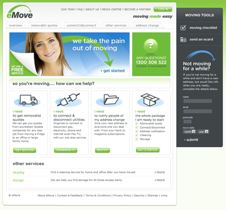

::: {#overview}
## Overview
:::

DNN (formerly DotNetNuke and also known as Evoq) is the leading Web Content Management Platform for Microsoft .NET. DNN can be used as a web content management system (CMS) for simple web sites or as a powerful application development framework which enables businesses to quickly build and deploy feature-rich, interactive web sites and applications in Microsoft .NET.

::: {#benefits}
## Benefits
:::

::: ticks
- Anyone in your company can edit content anywhere anytime
- Used by 250,000+ organizations worldwide
- Easy to Deploy & Customize
- Built on ASP.NET and SQL Server
- Large number of 3rd party modules
:::

[Need DotNetNuke hosting in Australia?](https://www.ssw.com.au/ssw/hosting/)

::: {#technologies}
## Key Technologies
:::

### DNN
DNN is an open source ASP.NET-based content management system used to create easy-to-use, updatable, customizable, and secure content management portals. It is ideal for creating and deploying projects such as commercial websites, corporate intranets and extranets, online publishing portals, and custom vertical applications. DotNetNuke provides automated content management capabilities and tools to maintain a dynamic and 100% interactive data-driven web site.

This collaborative project is quickly becoming the industry standard for scalable portal deployments on the Microsoft platform, with a growing community of over 200,000 users and a dedicated base of programming professionals. SSW is proud to have developed some of the most beautiful DotNetNuke sites in Australia.

**Figure: eMove - DNN content management system site developed by SSW Sydney**
