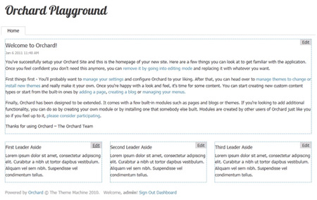

## Overview

Orchard is a free, open source, community-focused project aimed at delivering applications and reusable components on the rock-solid ASP.NET MVC platform. In our opinion it is the best architected CMS framework around and is built on top of the ASP.NET MVC framework.

## Benefits
- Individual .NET-based applications that appeal to end-users, designers, developers, and Web professionals
- A set of re-usable components that makes it easy to build such applications
- A vibrant community to help define these applications and extensions

Need Orchard hosting in Australia?

*Figure: The best feature of Orchard is just how easy it is to edit your content directly*

*Figure: Orchard is fully customizable from the very simple to the very complex*

## Key Technologies
### Orchard
Orchard is currently available as a V1 release. The project includes an extensibility model for modules and themes, a dynamic content type system, ease of customization, and more. The 1.2 release is currently available, and is easy to set-up on your local machine using the Web Platform Installer.