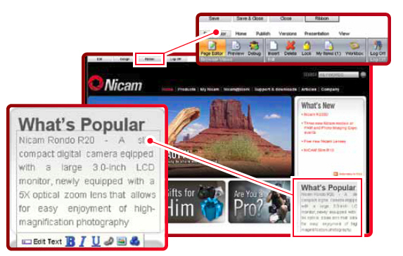

::: {#overview}
## Overview
:::

> We really like the configuration possibilities for the end user by combining the strengths of Sitecore and other technologies, such as Fredhopper. This gives our customers a compelling, interactive experience, and as a result, our sales have increased.
>
> WIM VERMAESEN, THOMAS COOK

Sitecore's mix of powerful marketing and business features, rich development support and scalability make it the ideal solution for leading websites. From entry level to the large organizations, creating and providing your visitors a compelling web experience has never been as easy or as exciting. Sitecore is being used by dozens of the world's largest organizations, managing sites that serve and delight millions of users.

To keep pace and excel in today's marketplace, websites have to provide more than mere content - they need to deliver compelling web experiences.

::: {#benefits}
## Benefits
:::

::: ticks
- SEO functionality
- Web forms for marketers
- Web Calendaring
- Web forums
- Powerful Search
:::

[Need DotNetNuke hosting in Australia?](https://www.ssw.com.au/ssw/hosting/)

::: {#technologies}
## Key Technologies
:::

### Sitecore
Sitecore's authoring interface represents a breakthrough in usability and design, and offers unrivaled ease of use. Our In-Line editing lets editors simply click on parts of the website to edit, without complications. No matter what skill level your content editors have, they'll be easily managing their Sitecore website in minutes.

**Figure: Sitecore allows inline editing**

Sitecore’s Page Editor technology provides a role-based interface that delivers exactly the right amount of capability to a user based on their needs.

For the casual user, the page editor presents a streamlined interface that allows them to navigate their site naturally, and simply type within the pages to make editorial changes. The more sophisticated user can be given a more active role in managing the site, including workflow control, metadata management, page design capabilities as well as publishing rights. By segmenting these users into different roles, the CMS automatically tailors the user interface to present the right amount of capabilities to the right user.
