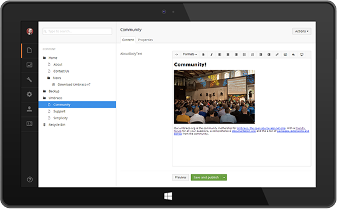

::: {#overview}
## Overview
:::

With over than 200.000 installations, Umbraco is one of the most deployed Web Content Management Systems on the Microsoft stack. It's in the top five most popular server applications and among the ten most popular open source tools in general.

::: {#benefits}
## Benefits
:::

::: ticks
- **Easy to learn and use** - editors have as little or as much freedom as they need. And if you don't like the changes made? Simply rollback to a previous version

- **Figure: Umbraco interface is beautiful and easy to use so you can focus on getting your message out to your peers, not how the technology works**
- **Compatible with Microsoft Word / Windows LiveWriter** - you can write or edit your blog or news pages without even opening the browser
- **Custom Design** - 100% control over templating and output, with no limitations to the design
- **Support for all** - strongly supported by both an active and welcoming community of users around the world, and backed up by a rock-solid commercial organization providing professional support and tools
:::

::: {#technologies}
## Key Technologies
:::

::: ticks
- **Multilingual websites out of the box** - you can also build in your chosen language with multilingual back office tools.
- **Integrate .NET Controls** - you can use .NET Custom Controls and User Controls without having to jump through hoops
- **Easy to use API's** - the Umbraco API gives you programmatic access to everything in the Umbraco CMS, plus the API is easy to use from Visual Studio or any other development tool
- **Flash? Silverlight? No problem** - Umbraco delivers content such as xml, which makes it a perfect match for delivering dynamic content to Flash, Silverlight, and other tools without altering your markup.
:::